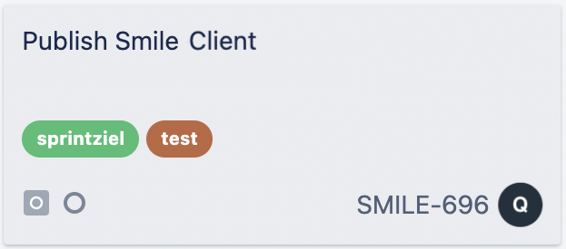

# userscript-jira-colored-labels

This userscript will colorize labels on jira board cards.

#### Screenshot

## Install
* [Install Tampermonkey](https://www.tampermonkey.net/) or any other userscript manager
* [Install userscript](https://github.com/qoomon/userscript-jira-colored-labels/raw/main/jira-colored-labels.user.js)
